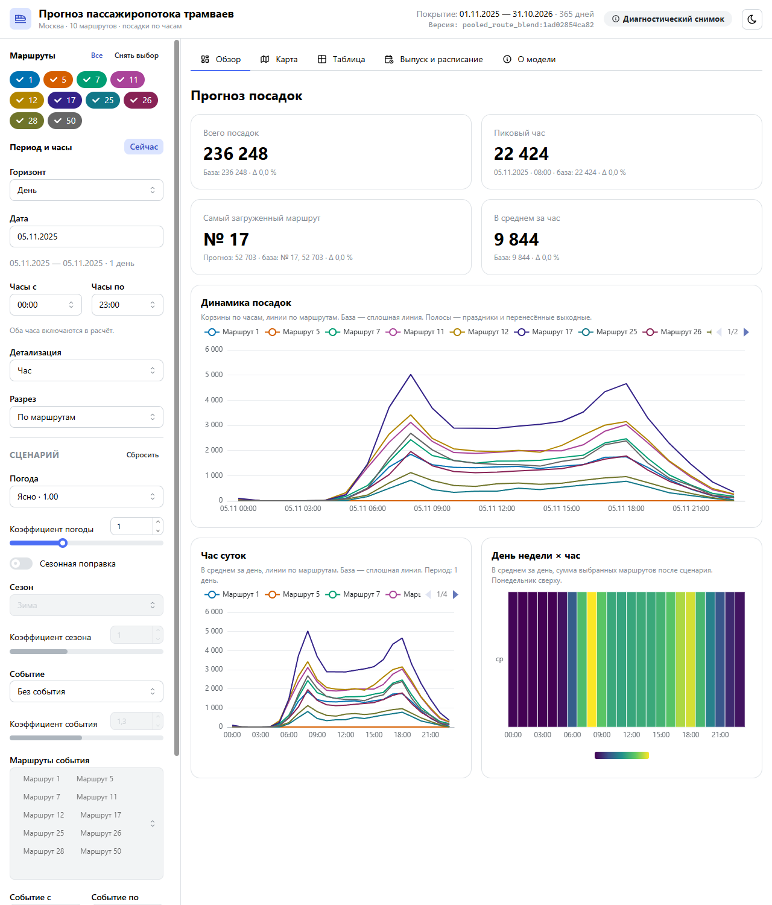

# Прогноз пассажиропотока московских трамваев

Проект хакатона по прогнозированию числа посадок на трамвайных маршрутах и веб-сервисом FastAPI для просмотра готовых прогнозов.

## Текущий статус

**27 сентября 2026: исследования модели завершены. `pooled_route_blend` принят как окончательный вариант на текущий этап — до получения внешних метрик от участника команды через Git.** Новые кандидаты, подбор параметров и исследовательские прогоны остановлены. К выбору модели возвращаемся после анализа поступивших метрик.

Зафиксирована конфигурация `POOLED_ROUTE_BLEND_CONFIG` в `accuracy.py`: среднее 50/50 общей и отдельных маршрутных моделей HistGradientBoosting, `random_state=42`. Финальный прогноз обучен на январе–октябре 2025 и покрывает ноябрь–декабрь. Воспроизводимая проверка delivery-snapshot после округления дала WAPE-score **84,5911%** на объединённых ранних срезах и **83,9942%** на сентябре–октябре. Официальная оценка ноября–декабря ещё неизвестна; заявленные ≈48% baseline относятся к этому скрытому периоду и напрямую с локальными оценками не сравниваются.

Принятый `pooled_route_blend` и диспетчерский дашборд слиты в `main`. Для поставки подготовлен годовой production snapshot: он заново проверен на трёх фиксированных временных срезах, встроен в Docker-образ и не требует датасета или ML-зависимостей при запуске.

Локально доступны оба исходных архива: `train.zip` с сырыми событиями января–августа и `Archive (1).zip` с labels, событиями сентября–октября и примером submission. В Git архивы не добавляются. Реализованы воспроизводимая подготовка почасовых данных, модели для экспериментов, FastAPI-сервис, статическая HTML-страница и самодостаточная Docker Compose-поставка.

## Данные

Официальный архив: [Яндекс Диск](https://disk.yandex.ru/d/DiFwlfMOauxjBg).

Состав датасета:

```text
data/
├── train.csv                     # январь–август 2025, находится в train.zip
├── test.csv                      # сентябрь–октябрь 2025
├── test_submission.csv           # пример файла решения
├── labels/
│   ├── labels_day_train.csv
│   └── labels_day_test.csv
└── spravochniki/                 # маршруты, остановки и координаты
```

Сырые CSV используют разделитель `;` и кодировку UTF-8. Основной timestamp — `tran_date_time`. Успешная посадка определяется условием `validation_result == 1`, маршрут берётся из `ngpt_route`. Служебные `begin_date_time` и `input_date_time` содержат некорректные годы, включая 2126; при работе с raw значения с годом вне 2025 нужно заменять на пропуск, а не исправлять подстановкой даты. `tran_date_time` валидируется отдельно и не заменяется.

Не распаковывайте многогигабайтные CSV без необходимости: команда подготовки читает малые labels прямо из `Archive (1).zip`. Архивы и производные результаты исключены из Git.

## Задача моделирования

Нужно спрогнозировать пассажиропоток на период с 1 ноября по 31 декабря 2025 года с почасовой детализацией для маршрутов `1, 5, 7, 11, 12, 17, 25, 26, 28, 50`.

Формат результата:

```text
route;date;hour;prediction
```

Файл должен содержать полную сетку из 14 640 строк: 10 маршрутов × 61 день × 24 часа. Значение `prediction` должно быть неотрицательным. Метрика — WAPE-score:

```text
WAPE       = sum(abs(y - prediction)) / sum(y)
WAPE-score = max(0, 1 - WAPE)
```

## Архитектура

- FastAPI — REST API и экспорт прогнозов;
- Python ML-контур — подготовка данных, обучение и инференс;
- статическая HTML/CSS/JavaScript-страница для выбора прогноза;
- Docker Compose — локальный запуск и поставка решения.

Текущий legacy snapshot покрывает только `маршрут × дата × час` на ноябрь–декабрь 2025 и является частичной реализацией новых требований сервиса ниже.

## Требуемый сервис

Пользовательский сервис должен поддерживать горизонты 1 день, 1 месяц и 1 год, фильтры по маршруту и времени, агрегацию, интерактивный временной график, карту Москвы с остановками и выгрузку CSV (XLSX не требуется, пока CSV покрывает экспорт). Час, день недели и сезонность включаются при наличии данных. Погода исследована как внешний источник, но не включена в итоговую модель: после учёта месяца её добавочный эффект на WAPE-score практически нулевой.

Расширенный diagnostic-артефакт `artifacts/service-diagnostic-year` содержит наблюдаемые `87,600` строк. После gzip и bounded aggregation cache year CSV прошёл 50/100/200 RPS, но не 400 RPS; month aggregation прошла 400 RPS. Годовой API, календарь 2026, агрегации, график и справочная география остановок ещё проходят review; OSM iframe ожидает browser proof. Существующий двухмесячный API/UI не закрывает эти требования, а финальный standard protocol для расширенного сервиса ещё не запускался.

Прогноз по остановкам пока невозможен: raw events не содержат идентификатора остановки, а `place_id` — площадка или депо. Reference XLSX содержит 489 остановок и 622 упорядоченные координаты, с пересечением маршрутов прогноза только `1, 5, 7, 11, 12`; это справочная карта, не прогноз по остановкам. Такой прогноз ожидает связанный исходный источник.

## Установка и запуск

Требуется Python 3.13.5. Базовый `pipeline` работает без сторонних зависимостей; зависимости для экспериментов и веб-сервиса устанавливаются отдельными файлами. Из корня репозитория:

```bash
python3 test_pipeline.py
python3 -m pipeline prepare --archive 'Archive (1).zip' --output-dir data/processed
python3 -m pipeline evaluate --data-dir data/processed --output-dir artifacts/baseline
```

`history.csv` содержит полную сетку января–октября (72 960 строк), `future.csv` — сетку ноября–декабря без target и prediction (14 640 строк), а `metadata.json` — хеши и диагностику источников. Оценка сохраняет прогнозы и `metrics.json` для трёх фиксированных двухмесячных срезов.

MacBook CPU-бенчмарк использует отдельные точные зависимости и не нужен для обычного `pipeline`:

```bash
python3 -m pip install -r requirements-macos.txt
python3 test_experiments.py
python3 -m experiments --data-dir data/processed --output-dir artifacts/macbook-benchmark --summary MACBOOK_BENCHMARK.md
```

Измеренные лучшие прогоны и baseline находятся в [MACBOOK_BENCHMARK.md](MACBOOK_BENCHMARK.md); полный JSON создаётся локально в `artifacts/macbook-benchmark/results.json`.

Измеренные WAPE-score: май–июнь — `0.82669`, июль–август — `0.77916`, сентябрь–октябрь — `0.86230`. Последний срез уже изучался в EDA и не является независимым holdout. Baseline использует только `route × weekday × hour`, не обновляется внутри двухмесячного горизонта и не моделирует праздники, зимнюю сезонность или смены режима маршрутов.

## Внешние источники

### Производственный календарь

Календарные признаки 2025 и 2026 годов хранятся в `calendar_2025.json` и
`calendar_2026.json`. Источники, записанные непосредственно в этих файлах:

- 2025: [Постановление Правительства РФ от 04.10.2024 № 1335](https://government.ru/docs/all/155500/);
- 2026: [Постановление Правительства РФ от 24.09.2025 № 1466](https://government.ru/docs/all/161028/);
- для обоих лет: [Трудовой кодекс РФ, статьи 95 и 112](https://pravo.gov.ru/proxy/ips/?docbody=&nd=102074279).

### Погода и измеренный эффект

Источник — [Open-Meteo Historical Weather API](https://open-meteo.com/en/docs/historical-weather-api),
Москва (55.7558, 37.6173), часовой пояс Europe/Moscow. Загрузка и повторный расчёт:

```bash
python3 download_weather.py --output data/weather/moscow_2025_hourly.csv
python3 -m weather_effects --data-dir data/processed --weather data/weather/moscow_2025_hourly.csv --output weather_effects.json
```

Эффект измерен на сырых вневыборочных прогнозах `pooled_route_blend` без погодных
признаков для трёх фиксированных срезов май–октябрь 2025 года; каждый срез обучен
только на прошлом. Внутри среза отношение `Σфакт / Σпрогноз` каждой категории
нормировано на часы без осадков (`precipitation = 0`), затем срезы объединены с весом
по прогнозному пассажиропотоку. 95%-й интервал получен 10 000 бутстреп-выборками
целых дней независимо внутри каждого среза. Полный машиночитаемый результат:
`weather_effects.json`.

| Категория | Множитель | 95% ДИ | Часов | Достаточно данных |
| --- | ---: | ---: | ---: | :---: |
| Без осадков (база) | 1,000 | 1,000–1,000 | 3 570 | да |
| Дождь (> 0,2 мм/ч) | 0,931 | 0,896–0,967 | 363 | да |
| Снегопад | 0,928 | 0,796–1,131 | 11 | нет, мало данных |
| Мороз ниже −10 °C | — | — | 0 | нет, мало данных |
| Мороз ниже −20 °C | — | — | 0 | нет, мало данных |
| Жара выше +25 °C | 0,980 | 0,959–1,004 | 315 | да |

Измеренный эффект подтверждён для дождя: после нормировки посадки составляют около
`0,931` от базового уровня, и 95%-й интервал не включает `1`. Для жары интервал
включает `1`, а для снегопада данных недостаточно; морозных часов в этих трёх срезах
не было.

Абляция погодных признаков при числовом месяце дала `+0,009` WAPE-score
(`0,834 → 0,843`). В конфигурации с категориальным месяцем, соответствующей итоговой
`pooled_route_blend`, добавочный эффект погоды ≈ `0` (`0,843738 → 0,843937`): месяц
поглощает сезонную часть погодного сигнала. Поэтому финальная модель остаётся
`pooled_route_blend` без погоды.

Ограничение: Open-Meteo Archive содержит фактически наблюдавшуюся погоду. Для
ноября–декабря это **идеальный прогноз**, недоступный в реальной эксплуатации;
долгому горизонту потребовались бы прогноз погоды или климатическая норма.

## Точность моделей

### Calendar/weather model v2

Эксперимент с представлением месяца, особыми днями и погодой запускается отдельно и не меняет
принятую конфигурацию в `accuracy.py`:

```bash
python download_weather.py --output data/weather/moscow_2025_hourly.csv
python -m model_v2 --data-dir data/processed --weather data/weather/moscow_2025_hourly.csv --output-dir artifacts/model-v2/run-1
```

Источник — [Open-Meteo Historical Weather API](https://open-meteo.com/en/docs/historical-weather-api),
Москва (55.7558, 37.6173), часовой пояс Europe/Moscow. Используются `temperature_2m`,
`precipitation`, `rain`, `snowfall`, `snow_depth`, `weather_code`. Архивная погода за
ноябрь–декабрь является **идеальным прогнозом** и завышает реалистичность эксперимента: в
эксплуатации прогноз погоды доступен примерно на 1–10 дней, для горизонта месяц/год нужна
климатическая норма. Итоги конкретного запуска находятся в `artifacts/model-v2/report.md`.

Технический порог production-экспорта — абсолютный WAPE-score не ниже `0.80` на каждом фиксированном срезе (`pipeline.TARGET_WAPE_SCORE`). Перед сборкой поставки `build_service_snapshot.py` переобучает принятый `pooled_route_blend` только на прошлом каждого среза и блокирует публикацию при провале хотя бы одного среза. В комплекте `service_snapshot/quality.json` зафиксированы пересчитанные результаты `0.8589` / `0.8319` / `0.8399`; все три проходят порог. Прогноз после 31 декабря 2025 года является непроверенным расширением годового горизонта, что явно записано в метаданных.

| Модель | Май–июнь | Июль–август | Combined |
| --- | ---: | ---: | ---: |
| Frozen winner | 0.8569491031363826 | 0.827249659505492 | 0.8426582436223181 |
| Profiles, iteration 1 | 0.7810820431182067 | 0.8432921981059021 | 0.811016495639487 |
| Residual, iteration 2 | 0.7466318040997776 | 0.8216491156173606 | 0.7827288392275848 |
| Iteration 3 | 0.8429673803121243 | 0.7686443449895637 | 0.807204418902678 |
| Iteration 4 | 0.8347909597405083 | 0.8244193711040455 | 0.8298003303541991 |
| `per_route_hgb`, iteration 5 | 0.8597336325612007 | 0.835122582872072 | 0.847891220360752 |
| `hierarchical_hgb`, iteration 6 | 0.8505674636468166 | 0.7884198245631713 | 0.8206630926992277 |
| `pooled_route_blend`, iteration 7 | 0.8609411966587857 | 0.8349985464966838 | 0.8484580413008345 |
| `seasonal_interaction`, iteration 8 | 0.7988347795185595 | 0.7373910274434788 | 0.7692691068468773 |
| `raw_activity_hgb`, iteration 9 | 0.7739282721688941 | 0.8369533543409158 | 0.8042548535815481 |
| `per_route_device_density`, iteration 10 | 0.8413697837929827 | 0.83140189923337 | 0.8365734098384997 |
| `pooled_fare_components`, iteration 11 | 0.8409473855500834 | 0.8097351673160399 | 0.8259286050150468 |
| `per_route_fare_components`, iteration 12 | 0.8437722127181352 | 0.8249609331514642 | 0.8347205497675378 |

```bash
python3 -m accuracy --variant profiles --output-dir artifacts/accuracy/verification-profiles
python3 -m accuracy --variant residual --output-dir artifacts/accuracy/verification-residual
python3 -m accuracy --variant pooled_route_blend --output-dir artifacts/accuracy/verification-blend
# Historical raw operational activity; rerun only into a fresh output directory.
python3 -u -m raw_activity
python3 -m accuracy --variant raw_activity_hgb --output-dir artifacts/accuracy/verification-raw-activity
python3 -m accuracy --variant per_route_device_density --output-dir artifacts/accuracy/verification-device-density
```

`pooled_route_blend` остаётся текущим лучшим измеренным вариантом. `raw_activity_hgb`, `per_route_device_density`, `pooled_fare_components` и `per_route_fare_components` отклонены: combined `0.8042548535815481`, `0.8365734098384997`, `0.8259286050150468` и `0.8347205497675378`; iteration 12 заняла `17.918972416999168` s. Для iteration 11 исправлены только diagnostics: authoritative envelope — `artifacts/accuracy/iteration-11/results-corrected.json`, hash `17c8ed51eaa29271e1f5b76c52dd021587367da5655dda63ae8d17bbaba66f82`; original score/CSV не изменились, независимый пересчёт WAPE это подтвердил. Извлечение fares выполнено один раз: `62,443,497` событий дали `1,574,655` positive-fare-hour rows, все `72,960` parent keys и `59,667,191` boardings; метаданные: `data/processed/raw_fares.metadata.json`. Извлечение activity обработало всего `62,443,497` событий из обоих архивов (`49,051,926` train и `13,391,571` test), сохранило `62,442,882`, исключило `615` вне января–октября, нашло `59,667,191` посадку и `72,960` ячеек с `0` расхождений; метаданные: `data/processed/raw_activity.metadata.json`. Для нового запуска используйте новый output-dir и не перезаписывайте измеренные `artifacts/accuracy/iteration-1` … `artifacts/accuracy/iteration-12`, включая предыдущий `per_route_hgb`.

## Веб-сервис прогнозов

Код сервиса отдаёт готовый снимок без обучения при HTTP-запросе. Каталог `service_snapshot/` входит в репозиторий и Docker-образ: 87 600 строк на период 01.11.2025–31.10.2026, `serving_mode: production`, `quality_passed: true`. `quality.json` содержит измерения по каждому validation-срезу и защищён хешем в `metadata.json`.

```bash
python3 build_service_snapshot.py \
  --data-dir data/processed \
  --reference-map artifacts/service/reference_map.json \
  --output-dir service_snapshot-new \
  --horizon year
```

Для запуска без Docker сервис использует тот же встроенный snapshot:

```bash
python3 -m pip install -r requirements-service.txt
FORECAST_DIR=service_snapshot uvicorn forecast_api:app --host 127.0.0.1 --port 8000
```

Откройте `http://127.0.0.1:8000/`: сервис отдаёт по `/` диспетчерский дашборд — один самодостаточный HTML-файл `static/index.html`. API также предоставляет `/health`, `/forecasts` (например, `/forecasts?route=17&start_date=2025-11-03&end_date=2025-11-03&hour=8`), `/forecasts/export.csv`, `/forecasts.csv` и `/reference-map`.

### Интерфейс

Дашборд работает поверх неизменённого сервиса и читает только эти эндпоинты; внешняя сеть нужна лишь для тайлов подложки карты. Покрытие, версию снимка и режим (`production` или `diagnostic`) он берёт из `/health`.

| Вкладка | Что показывает |
| --- | --- |
| Обзор | Ключевые показатели, динамику посадок по часам, профиль часа суток и тепловую карту «день недели × час» |
| Карта | Линии маршрутов на подложке OpenStreetMap в пяти классах нагрузки выбранного часа, проигрывание суток, прогноз по остановке |
| Таблица | Строки текущей детализации с итогом и выгрузкой текущего вида в CSV |
| Выпуск и расписание | Пиковый час каждого маршрута, требуемые рейсы в час и интервал движения при редактируемых допущениях |
| О модели | Модель и снимок, WAPE-score по срезам проверки, область применимости, источники данных и ограничения |

Фильтры — маршруты, горизонт (день, месяц, год, произвольный период), диапазон часов и детализация — синхронизированы с URL, поэтому ссылка восстанавливает вид. Сценарные коэффициенты (погода, сезон, событие) применяются на клиенте к базовому прогнозу: это экспертные допущения, модель на погоде не обучена. Интерфейс русский, светлая и тёмная темы, ширина от 375 px.



Ещё скриншоты: [карта нагрузки](docs/frontend/map.png), [сценарий](docs/frontend/scenario.png), [«О модели»](docs/frontend/model.png).

Исходники — в `frontend/`. `static/index.html` — артефакт сборки: он коммитится и руками не редактируется. Пересборка (нужен Node 24):

```bash
cd frontend && npm ci && npm run build
```

Сборка кладёт результат в `frontend/dist/index.html`, копирует его в `static/index.html` и проверяет, что файл самодостаточен и укладывается в 3,5 МБ. Разработка, mock-режим без бекенда и снимок прогноза для разработки описаны в [frontend/README.md](frontend/README.md).

Docker Compose уже содержит production snapshot, использует один Uvicorn worker и лимиты 2 CPU / 2 GiB без дополнительного swap. Из чистого клона достаточно одной команды:

```bash
docker compose up -d --build
# UI:     http://localhost:8000/
# health: http://localhost:8000/health
docker compose down
```

Healthcheck требует `ready=true`, `serving_mode=production` и `quality_passed=true`. Для проверки другого валидного snapshot используйте overlay:

```bash
FORECAST_SNAPSHOT_DIR=./path/to/snapshot docker compose -f compose.yaml -f compose.snapshot.yaml up -d --build
```

Базовая проверка тестов:

```bash
python3 -m unittest discover
```

## Производительность

Диагностический HTTP-бенчмарк завершён на `MacBook-Pro.local` (macOS ARM), где генератор и Docker Desktop service разделяли один хост через loopback. Это не подтверждает качество модели и не является SLA для отдельного Linux-сервера. Полный протокол и результаты: [HTTP_BENCHMARK.md](HTTP_BENCHMARK.md).

| Профиль, 400 requested RPS | Completed RPS | p95, ms | Errors | Missed |
| --- | ---: | ---: | ---: | ---: |
| hour | 399.400000 | 4.230750 | 0 | 18 |
| day | 399.633333 | 3.995083 | 0 | 11 |
| week | 399.800000 | 3.935792 | 0 | 6 |
| csv | 399.066667 | 3.975125 | 0 | 27 |
| day soak, 900 s | 399.107778 | 4.017041 | 0 | 802 |

Все 16 ступеней прошли правила `>1%` errors, `p95 >300 ms` и `<95%` target RPS. Генератор всё же отмечен `generator_limited` из-за пропущенных/запоздалых arrivals; это видно в отчёте и не скрыто очередью. Контейнер имел 2 CPU и 2 GiB RAM; `MemorySwap=2 GiB` равен `Memory=2 GiB`, поэтому дополнительный swap равен нулю. Короткие стадии показали CPU mean/max `25.10%/51.36%` и RAM `36.05–37.89 MiB`, soak — `45.40%/53.52%` и `36.66–39.29 MiB` (CPU — в расчёте одного ядра).

Воспроизводимая команда диагностического замера:

```bash
python3 -m benchmark_http --base-url http://127.0.0.1:8000 --container transport-forecast-1 --workers 1 --topology 'macOS loopback to Docker Desktop published port; generator and target share host; training stopped' --output artifacts/http-diagnostic.json
```

Первый expanded-year прогон завершился с отказами и не является приёмочным результатом: `year_csv` прошёл 50 RPS (p95 `16.380 ms`), но на 100 RPS получил `69.733` completed RPS, p95 `7567.857 ms` и 16 ошибок; `year_month` на 50 RPS получил p95 `5006.451 ms` и 1497 ошибок. После gzip и bounded aggregation cache второй supplemental run (`artifacts/http-diagnostic-year-compressed.json`) завершился, но остаётся `acceptance_failed: true`: `year_csv` прошёл 50/100/200 RPS, а 400 RPS не прошёл (`369.866667` completed RPS, p95 `18.766166 ms`, 0 ошибок); `year_month` прошёл 400 RPS (`398.966667` completed RPS, p95 `4.251125 ms`, 0 ошибок). Plain CSV — `2,901,675` bytes, gzip — `513,059` bytes; decompressed SHA-256 `231a098112d78d9069f23bcb03f63719053d82508570f44a0a5dec413ec17180`.

Финальный standard diagnostic report `artifacts/http-diagnostic-year-standard.json` завершился штатно (`nonstandard: false`, `acceptance_failed: false`) на backend hash `12f094643f98f246d699274d9904584a9afd182dfab697f36a8dc18192f49280` и diagnostic snapshot `231a098112d7`. Все 16 коротких ступеней прошли. На 400 RPS: hour `399.2` RPS/p95 `4.498291 ms`, day `398.933333`/`4.602584 ms`, week `398.266667`/`4.788500 ms`, CSV `398.7`/`3.704834 ms`; ошибок на этих ступенях не было. Soak day 900 s: `398.454444` completed RPS, p95 `4.511458 ms`, p99 `6.772833 ms`, 1 ошибка (`error_ratio 0.000002788552`), 1,391 missed (`0.386389%`), `generator_limited: true`, accepted. CPU soak (337 samples) mean/max `41.569852%/49.16%` одного ядра; RAM `54.99–57.61 MiB`.

Это performance evidence исторического диагностического снимка, а не отдельный production-quality claim. Delivery-snapshot независимо прошёл порог с combined early `0.8459114822`; прогноз остановок недоступен без boarding-to-stop link, а измеренная погода не включена в финальную модель из-за практически нулевого добавочного эффекта после учёта месяца. OSM direct URL и marker работают; inline iframe в IAB остаётся неподтверждённым. Новых benchmark/scans/model runs не запланировано без нового запроса пользователя.

Команда дополнительного прогона использует только годовые профили, те же 10-секундный warmup, 30-секундные ступени и 50/100/200/400 RPS, без day soak:

```bash
python3 -m benchmark_http --base-url http://127.0.0.1:8000 --container transport-forecast-1 --workers 1 --profiles year_csv,year_month --soak 0 --output artifacts/http-diagnostic-year.json
```

Подробности обеих supplemental attempts и финального standard report: [HTTP_BENCHMARK.md](HTTP_BENCHMARK.md). Они не изменяют исторический HTTP-результат.

Последняя полная проверка: `python3 -m unittest discover` — 74 passed in 13.829 seconds; `git diff --check` passed.

Целевой режим — сотни RPS при p95 менее 200–300 мс на 2–4 vCPU и 2–4 ГБ RAM без swap.

## Проверка лучшего кандидата по правилам Archive README

Повторный локальный запуск `pooled_route_blend` с фиксированными параметрами и округлением прогнозов к целому:

```bash
python3 artifacts/accuracy/readme-test/evaluate.py
```

| Период 2025 | Строк | WAPE | WAPE-score |
| --- | ---: | ---: | ---: |
| Май–июнь | 14 640 | 0.1410584958 | 0.8589415042 |
| Июль–август | 14 880 | 0.1681376510 | 0.8318623490 |
| Сентябрь–октябрь | 14 640 | 0.1600584140 | 0.8399415860 |

На каждом срезе обучение использует только прошлое, без обновления внутри горизонта. Combined ранних срезов после округления — `0.8459114822`; это отношение сумм ошибок и фактических посадок, а не среднее score. Ранние срезы использовались для выбора модели; сентябрь–октябрь ранее изучался в EDA, поэтому оценки не являются результатом на независимом скрытом тесте. Округление — Python `round` (половины к чётному); правило для половин у организаторов не указано.

Локальные результаты, разбивки по маршрутам/месяцам/часам и хеши сохранены в `artifacts/accuracy/readme-test/results.json`. Там же `submission.csv`: прогноз ноября–декабря после обучения на январе–октябре, UTF-8, `;`, точный заголовок, 14 640 уникальных ключей в порядке `test_submission.csv`, неотрицательные целые прогнозы. SHA-256 принятого submission и `/forecasts.csv` из delivery-контейнера: `9bac9c421fb8d1762ef4d9c7267f5fdcae9edeb6cd59868f156c399be15daeca`. Скрипт сверяет history с labels архива и проверяет сохранённые CSV. Delivery-snapshot версионируется в `service_snapshot/`; остальные сгенерированные артефакты исключены из Git.

Официальный WAPE-score ноября–декабря неизвестен: скрытый ground truth отсутствует. Значение baseline ≈0.48 относится к скрытому периоду и напрямую с локальными score не сравнивается. Этот запуск не изменяет quality gate и снимок веб-сервиса.

## Windows benchmark

Отдельный Windows-прогон выполнен на Ryzen/RTX 5070 Ti и сохранён без замены основного Mac/model-research контура. Полные условия, модельные метрики, хеши и ограничения приведены в [Windows benchmark report](docs/windows-benchmark-report.md).

Устойчивый 15-минутный профиль суток прошёл при 100 offered RPS: 90 000/90 000 completed, 0 ошибок, 0 пропусков, 99.95 completed RPS и p95 11.86 мс. Устойчивые 200 RPS не подтверждены. Эти loopback-измерения Windows не подтверждают SLA на 2–4 vCPU/2–4 ГБ Linux.

```powershell
py -3.12 -m venv .venv
.\.venv\Scripts\python.exe -m pip install -r requirements-windows.lock
.\.venv\Scripts\python.exe -m unittest -v
.\.venv\Scripts\python.exe -m pipeline prepare --archive dataset --output-dir data\processed
.\.venv\Scripts\python.exe -m windows_experiments preflight --manifest configs\experiments.windows.json --data-dir data\processed --report artifacts\benchmark\preflight-windows.json
```
